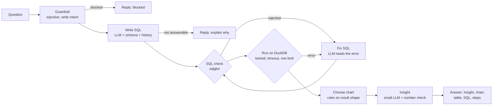

# DataChat: ask your data anything

DataChat turns plain-English questions into SQL, runs them safely, and answers with a chart, a short
insight and the exact query behind it. Upload a CSV or Excel file, or try one of three sample datasets.

**Live demo:** `https://<your-app>.onrender.com` (the free instance sleeps when idle; the first visit takes about a minute)

```
"Which city's sales dropped most last quarter?"
   → SQL written by an LLM → checked → run on DuckDB → fixed automatically if it fails
   → diverging bar chart + "Kochi fell the most, down 30.7%…" + the SQL, the table and every step
```

## What it does

- **Text-to-SQL agent** built with LangGraph: guardrail → write SQL → safety check → run → chart → insight.
- **Self-correction:** when a query is rejected or the database returns an error, the agent reads the error
  and rewrites the query (up to 2 times). Every attempt is shown live in the **Steps** tab.
- **Three safety layers**, so a model mistake or a malicious question can never change data or read files:
  1. a static SQL check (sqlglot): one read-only `SELECT`, known tables only, no file or system functions;
  2. each dataset lives in its own in-memory DuckDB with file and network access switched off and the
     configuration locked;
  3. a timeout and a row limit on every query.
- **Grounded insights:** every number in the model's one-paragraph insight is checked against the query result.
  If a number cannot be found (allowing for rounding), the model gets one retry; after that a plain,
  always-correct summary is shown instead.
- **Streaming:** each step reaches the browser as it happens (server-sent events).
- **Follow-ups** ("now only for Karnataka") use the last three questions and their SQL as context.
- **Dashboard:** pin any answer; pinned cards re-run their saved SQL when opened.
- **Evaluation:** 60 hand-written questions with gold SQL, scored by execution accuracy (below).
- **Operations:** answer cache, per-request token/cost/latency metrics, `/api/stats`, rate limiting,
  model failover (`gpt-oss-120b` → `gpt-oss-20b`), Docker, GitHub Actions CI.

## Architecture



| Part | Choice | Why |
|---|---|---|
| Agent | LangGraph state machine | Retry loops and branches are explicit, testable edges, not hidden in a prompt |
| SQL engine | DuckDB (in-memory, one database per dataset) | Fast analytics on CSV/Excel, no server, easy to lock down |
| SQL safety | sqlglot parse + allow-list | Rejects writes, multiple statements, file functions and unknown tables before anything runs |
| Models | Groq: `gpt-oss-120b` writes SQL, `gpt-oss-20b` writes insights and is the fallback | The big model only where accuracy matters; the cheaper one for short text |
| Charts | Rules on the result's column types | Instant, predictable and unit-tested; no extra model call |
| Storage | SQLAlchemy: SQLite locally, PostgreSQL in production | History for follow-ups and pinned dashboard cards |
| Front end | Plain HTML, CSS and JavaScript; SVG charts | No build step, small and fast |

## Evaluation

`eval/questions.jsonl` has 60 questions over the three sample datasets (20 each; 21 easy, 24 medium,
15 hard), each with a hand-written gold query. A question counts as correct when the agent's query returns
the same rows as the gold query: extra columns are allowed, column order and row order do not matter, and
numbers are compared after rounding to one decimal (`eval/compare.py`). The fallback model is switched off
during evaluation, so each run measures exactly one model.

```bash
python -m eval.run_eval --check-gold                    # every gold query runs and returns rows (no API key)
python -m eval.run_eval --sleep 2                       # full run with the default model
python -m eval.run_eval --model openai/gpt-oss-20b      # compare another model
python -m eval.run_eval --only s16,h18 --verbose        # debug single questions
```

Results go to `eval/results/latest.json` (shown on the app's **Benchmark** page), `eval/results/report.md`
and a per-question file for error analysis. The runner works with any OpenAI-compatible endpoint
(`--base-url`), so a local model served by Ollama can be measured on exactly the same questions.

**Results:** see [`eval/results/report.md`](eval/results/report.md) after the first run.

## Run locally

```bash
python -m venv .venv
source .venv/bin/activate            # Windows: .venv\Scripts\activate
pip install -r requirements-dev.txt
cp .env.example .env                 # Windows: copy .env.example .env   — then add your GROQ_API_KEY
uvicorn app.api:app --reload --port 7860
```

Open http://localhost:7860. Run the tests with `pytest` (151 tests; the model is scripted, so no key or
network is needed) and the linter with `ruff check .`.

## Deploy on Render (free)

1. New → **Web Service** → connect this repository. Language: **Docker**. Instance type: **Free**.
2. Environment: `GROQ_API_KEY` = your key. Optional: `DATABASE_URL` = a PostgreSQL URL (for example a free
   Neon database) so history and pins survive restarts.
3. Health check path: `/api/health`. Deploy.

The free instance has 512 MB of memory; DataChat uses about 220 MB with all three sample datasets loaded,
because no model runs on the server.

## API

| Endpoint | Purpose |
|---|---|
| `GET /api/datasets`, `GET /api/datasets/{id}` | Sample datasets; tables, columns and example values |
| `POST /api/upload` | Upload a CSV or XLSX (each sheet becomes a table); returns its schema |
| `POST /api/ask` | `{dataset_id, question, session_id, conversation_id}` → event stream: `step`, `sql`, `result`, `chart`, `insight`, `done` |
| `POST /api/explain` | Plain-English explanation of a query |
| `GET/POST/DELETE /api/pins` | Dashboard cards |
| `GET /api/benchmark`, `GET /api/stats`, `GET /api/health` | Evaluation results, live metrics, health |

Interactive documentation: `/docs`.

## Project structure

```
app/
  agent.py       LangGraph agent: nodes, retry edges, streaming
  sqlguard.py    Static SQL safety check (sqlglot)
  datasets.py    DuckDB loading, profiling, locked execution with timeout
  samples.py     Deterministic synthetic sample data (store, food delivery, HR)
  insight.py     Number check for model-written insights
  charts.py      Chart choice from the result's shape
  llm.py         OpenAI-compatible client, JSON parsing, failover, token and cost tracking
  prompts.py     All prompts
  store.py       History and pins (SQLite or PostgreSQL)
  api.py         FastAPI app, streaming, cache, rate limit, stats
  static/        Web UI
eval/            Gold questions, comparison, evaluation runner, results
tests/           151 tests with a scripted model
```

## Design decisions

- **Safety does not depend on the model.** The prompt asks for read-only SQL, but the guarantee comes from the
  parser check and the locked database. A test makes the model "write" `DELETE FROM orders` and checks the data
  is unchanged.
- **Errors are fed back, not hidden.** The real database error goes back to the model, and the user sees each
  attempt. The evaluation records how often a fix was needed.
- **Relative dates follow the data.** "Last quarter" means the last quarter in the data, which the schema
  shows the model through each date column's minimum and maximum.
- **Numbers in text are verified.** An LLM summarising a table can still invent a figure; the insight check turns
  that into a measurable, recoverable step.

## Limitations

- Upload data stays in server memory for an hour and is lost when the free instance restarts.
- The semantic layer is the profiled schema only; very wide or cryptically named tables reduce accuracy.
- Questions that need data the dataset does not have are declined rather than guessed.

## License

MIT. All sample data is synthetic and generated from fixed random seeds.
